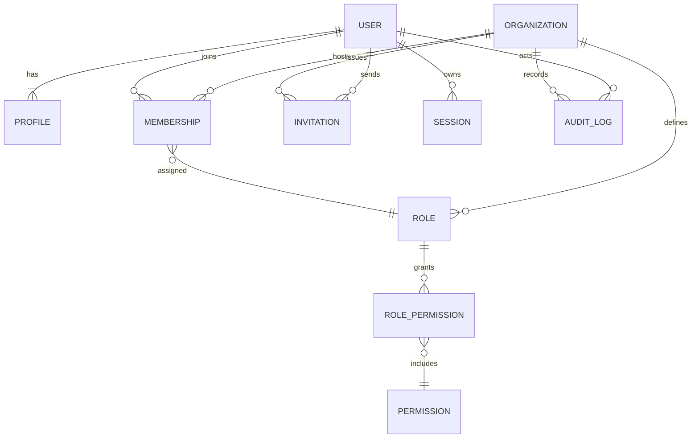
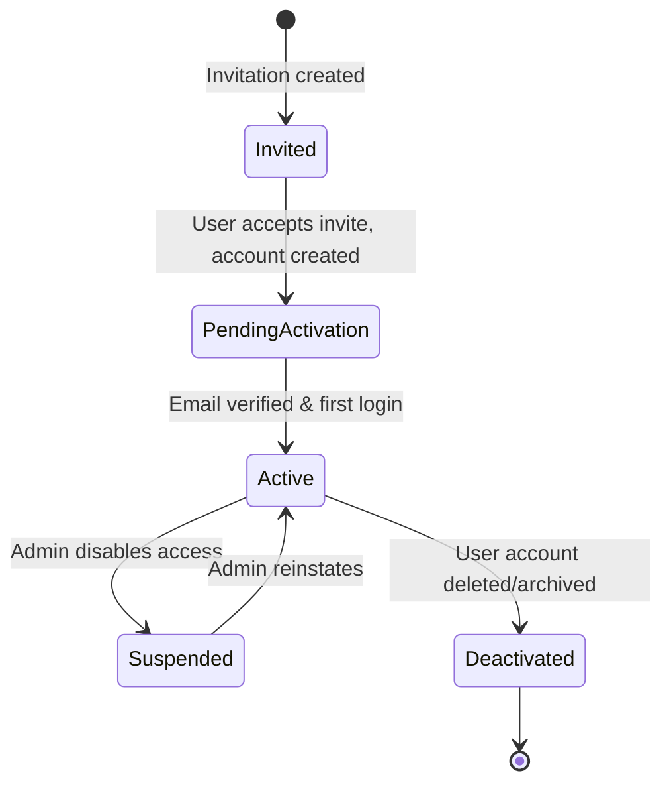
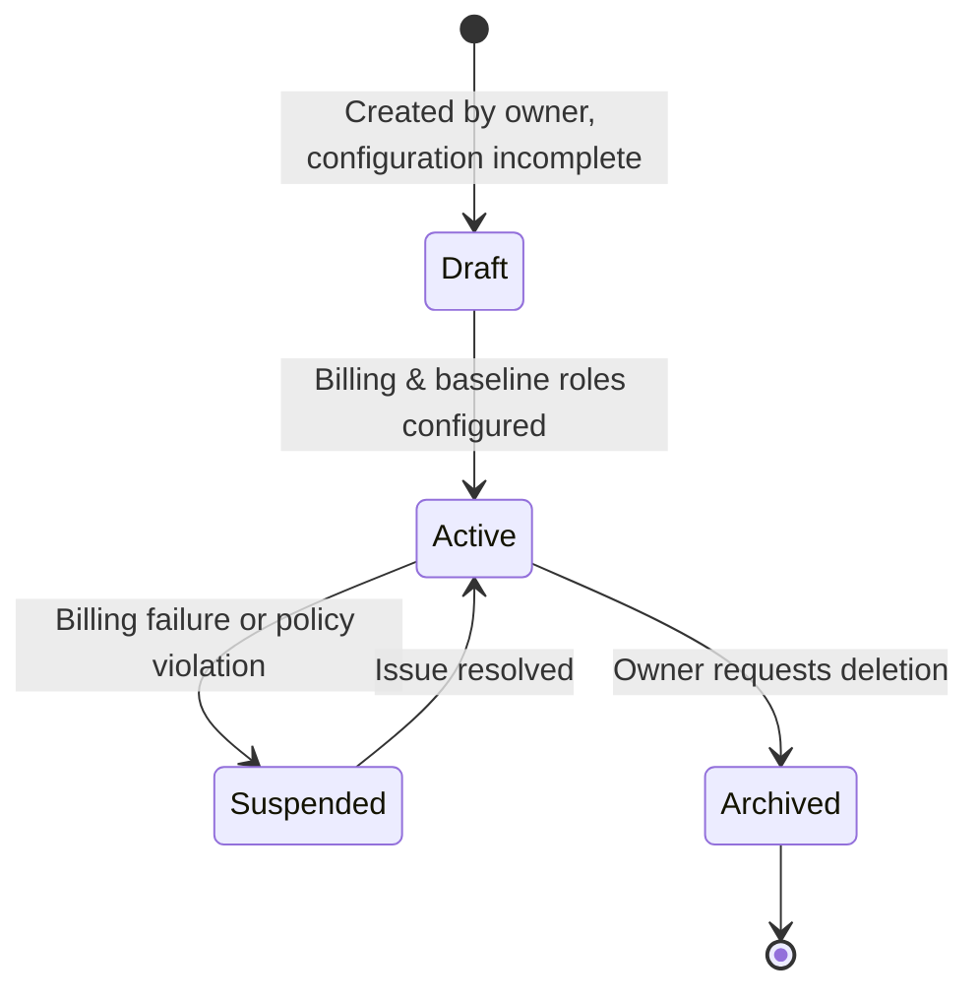
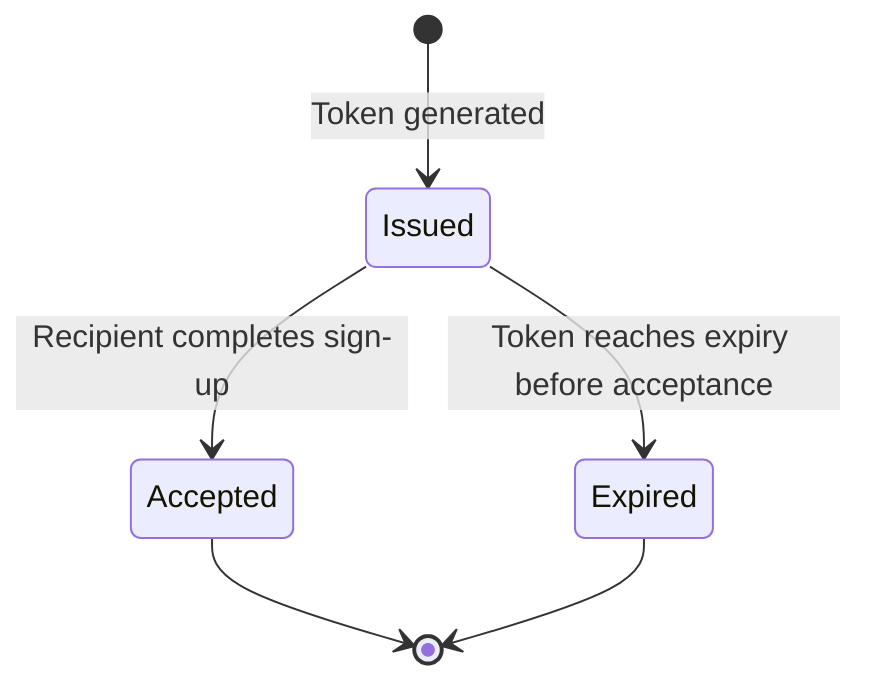

# Domain Architecture

## Core Entities

| Entity | Description | Key Attributes |
| --- | --- | --- |
| **User** | Represents an individual accessing the platform. | `id`, `email`, `phone_number`, `password_digest` (if local), `status`, `created_at`, `last_login_at` |
| **Profile** | Extension of the User with personal details. | `user_id`, `first_name`, `last_name`, `avatar_url`, `locale`, `timezone` |
| **Organization** | Logical tenant grouping users and resources. | `id`, `name`, `slug`, `status`, `owner_user_id`, `created_at` |
| **Membership** | Junction between User and Organization describing roles. | `id`, `user_id`, `organization_id`, `role_id`, `invited_by`, `joined_at` |
| **Role** | Defines a named permission bundle per organization. | `id`, `organization_id`, `name`, `description`, `is_system_default`, `created_at` |
| **Permission** | Action-level capability that can be linked to roles. | `id`, `key`, `resource`, `description` |
| **RolePermission** | Associative link between Roles and Permissions. | `role_id`, `permission_id`, `granted_at`, `granted_by` |
| **Invitation** | Tracks pending user onboarding to an organization. | `id`, `organization_id`, `email`, `invited_role_id`, `token`, `expires_at`, `accepted_at` |
| **Session** | Persisted refresh sessions for the auth flow. | `id`, `user_id`, `refresh_token`, `issued_at`, `expires_at`, `last_used_at`, `ip_address`, `user_agent` |
| **AuditLog** | Immutable record of significant lifecycle events. | `id`, `actor_user_id`, `organization_id`, `event_type`, `payload`, `ip_address`, `occurred_at` |

## Relationships Overview

- A **User** has one **Profile** and can belong to many **Organizations** through **Memberships**.
- An **Organization** owns many **Memberships**, **Roles**, **Invitations**, and **AuditLogs**.
- **Roles** group **Permissions**, and **Memberships** bind Users to Roles per Organization.
- **Invitations** link to Organizations (and optionally preset Roles) to facilitate onboarding.
- **Sessions** are tied to Users for refresh token handling.
- **AuditLogs** capture actions performed by Users (or system actors) within Organizations.

### Entity-Relationship Diagram

## Lifecycle Views

### User Lifecycle

### Organization Lifecycle

### Invitation Lifecycle

## Notes

- Audit events accompany each state transition for traceability.
- All lifecycle transitions are enforced via domain services to ensure consistent permission checks.
