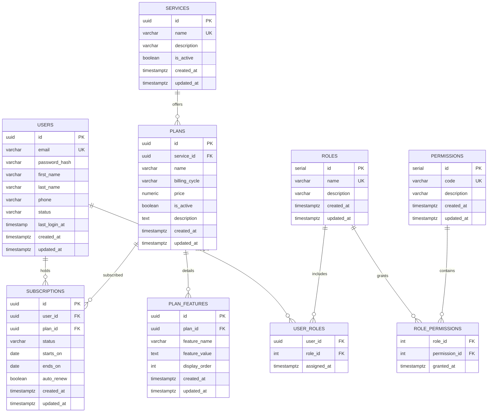

# Database Entity Relationship Diagram

```mermaid
erDiagram
    USERS ||--o{ USER_ROLES : assigns
    ROLES ||--o{ USER_ROLES : includes
    ROLES ||--o{ ROLE_PERMISSIONS : grants
    PERMISSIONS ||--o{ ROLE_PERMISSIONS : contains
    USERS ||--o{ SUBSCRIPTIONS : holds
    PLANS ||--o{ SUBSCRIPTIONS : subscribed
    SERVICES ||--o{ PLANS : offers
    PLANS ||--o{ PLAN_FEATURES : details

    USERS {
        uuid id PK
        varchar email UK
        varchar password_hash
        varchar first_name
        varchar last_name
        varchar phone
        varchar status
        timestamp last_login_at
        timestamptz created_at
        timestamptz updated_at
    }

    ROLES {
        serial id PK
        varchar name UK
        varchar description
        timestamptz created_at
        timestamptz updated_at
    }

    PERMISSIONS {
        serial id PK
        varchar code UK
        varchar description
        timestamptz created_at
        timestamptz updated_at
    }

    USER_ROLES {
        uuid user_id FK
        int role_id FK
        timestamptz assigned_at
    }

    ROLE_PERMISSIONS {
        int role_id FK
        int permission_id FK
        timestamptz granted_at
    }

    SERVICES {
        uuid id PK
        varchar name UK
        varchar description
        boolean is_active
        timestamptz created_at
        timestamptz updated_at
    }

    PLANS {
        uuid id PK
        uuid service_id FK
        varchar name
        varchar billing_cycle
        numeric price
        boolean is_active
        text description
        timestamptz created_at
        timestamptz updated_at
    }

    PLAN_FEATURES {
        uuid id PK
        uuid plan_id FK
        varchar feature_name
        text feature_value
        int display_order
        timestamptz created_at
        timestamptz updated_at
    }

    SUBSCRIPTIONS {
        uuid id PK
        uuid user_id FK
        uuid plan_id FK
        varchar status
        date starts_on
        date ends_on
        boolean auto_renew
        timestamptz created_at
        timestamptz updated_at
    }
```

> **Note:** Use a Mermaid-compatible renderer (such as GitHub or VS Code Mermaid preview) to visualize the ER diagram.
